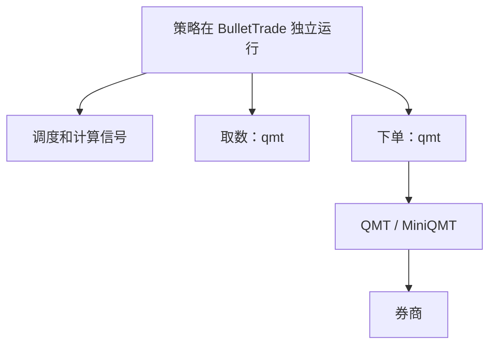
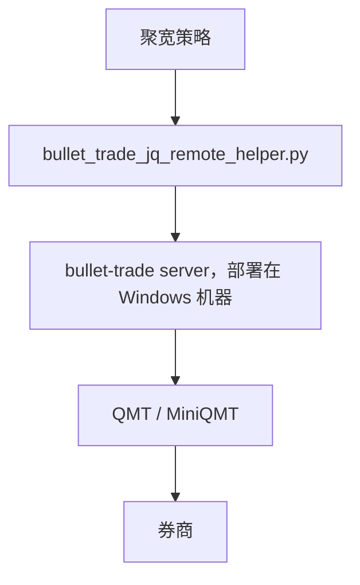
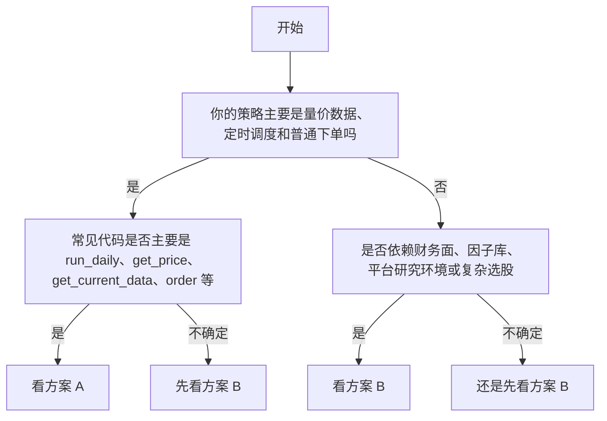

# 新手入门总览：先选方案，再看对应文档

这页只做一件事：  
帮你先看清楚 BulletTrade 现在支持哪两种方案、它们分别长什么样、你该怎么选。

如果你现在最大的困惑是这些：

- 聚宽策略能不能直接搬到本地运行
- 为什么简单买卖能跑，复杂策略却没有信号
- 我到底该先配独立运行，还是在聚宽模拟里面跑策略

那么先看完这页，再进入对应的方案文档。

## 先做一个共同前置步骤

两个方案都默认你已经有可用的 Python 环境。  
如果你现在连下面两个命令都还没跑通：

- `python --version`
- `pip --version`

先不要继续往后看，先做这一步：

- [环境准备：先安装 Python，再创建虚拟环境](python-setup.md)

## 我们现在支持两种方案

### 方案 A：独立运行

适合：

- 策略主要依赖量价数据、定时调度、普通下单
- 你希望把策略执行权放到自己机器或服务器
- 你想先跑通“本地策略 -> QMT”这条链路

结构图：



这条路的重点是：

- 你的策略主体在 BulletTrade 里跑
- BulletTrade 自己负责调度、取数、计算信号和下单
- QMT / MiniQMT 和策略放在同一台 Windows 机器上运行

### 方案 B：策略在聚宽侧模拟盘运行

适合：

- 策略强依赖聚宽侧环境、财务链路、平台因子或复杂选股
- 你暂时无法快速确认本地兼容性
- 你当前的目标是先把真实下单链路打通

结构图：



这条路的重点是：

- 策略逻辑继续在聚宽侧跑
- 聚宽负责产生交易动作
- BulletTrade 只负责接收信号，并通过本地 QMT 下单

> 聚宽侧改策略有两种方式：显式调用 helper，或接管聚宽函数。先看 [聚宽策略接入方案对比](joinquant-integration-options.md)，再选择 [方案 A：显式调用 helper](joinquant-helper-explicit.md) 或 [方案 B：接管聚宽函数](joinquant-live-takeover-usage.md)。

## 怎么决策选哪种方案

一句话判断：

- 如果你的策略核心可以概括成“取行情 + 算信号 + 下单”，优先看方案 A。
- 如果你的策略强依赖聚宽侧的财务、因子、研究环境或平台能力，优先看方案 B。

### 决策流程图



### 常见例子：哪些策略优先看方案 A

这类代码通常可以先按“独立运行”思路理解：

```python
from bullet_trade.core.api import *


def initialize(context):
    set_benchmark('000300.XSHG')
    run_daily(market_open, time='open')


def market_open(context):
    stocks = get_index_stocks('000300.XSHG')
    df = get_price(stocks[:10], end_date=context.previous_date, count=20, fields=['close'], panel=False)
    current = get_current_data()['000001.XSHE']
    if current.paused:
        return
    order_target_value('510300.XSHG', 100000)
```

这类策略通常主要依赖：

- `run_daily`
- `get_price / history / attribute_history`
- `get_current_data`
- `get_trade_days`
- `get_all_securities / get_index_stocks`
- `order / order_value / order_target / order_target_value`

常见类型：

- 均线策略
- 动量策略
- ETF 轮动
- 成交额过滤
- 网格或简单择时

### 常见例子：哪些策略优先看方案 B

下面这些不要先按“本地 QMT 无改动独立运行”来理解。  
更稳的做法是先让策略在聚宽侧模拟盘运行，再由 BulletTrade 接收信号执行本地 QMT 下单。

常见场景：

- 小市值或财务面选股
- 因子打分和多条件排序
- 强依赖平台研究环境的复杂选股
- 需要平台侧先算出股票池，再把买卖动作发给本地 QMT

这些策略的共同点是：

- 它们不只是“量价 + 下单”
- 它们不适合新手把第一枪打在“本地 QMT 无改动迁移”上

### 关于“财务因子是不是不支持”的更准确说法

如果是写给新手看，我建议用下面这句：

- **BulletTrade 独立运行优先保证的是量价、调度、下单这条通用链路**
- **如果你的策略主逻辑依赖财务面、因子库、平台研究环境或复杂选股，不要默认它属于“无改动可迁移”的范围**
- **这类策略新手优先看方案 B**

这样更容易帮用户做决策，也不会把“能不能做到”和“是不是适合第一步这么做”混在一起。

## 选择你的方案

如果下面哪一段更像你的实际情况，就直接点对应链接。

### 方案 A：独立运行

适合：

- 均线、动量、ETF 轮动、成交额过滤
- 主要用 `get_price`、`run_daily`、`order*`
- 希望策略、日志、运行状态都由自己掌控

这篇文档会讲：

- 环境准备
- 最小回测
- 本地 QMT
- 常见坑

入口：

- [进入方案 A 文档](beginner-route-a.md)

### 方案 B：策略在聚宽侧模拟盘运行

适合：

- 小市值、财务过滤、因子选股
- 依赖 `query`、`valuation`、`get_fundamentals`
- 想先把真实下单链路打通，再考虑迁移

这篇文档会讲：

- Windows / QMT
- `bullet-trade server`
- helper 上传
- 聚宽联调和测试单流程

入口：

- [进入方案 B 文档](beginner-route-b.md)
