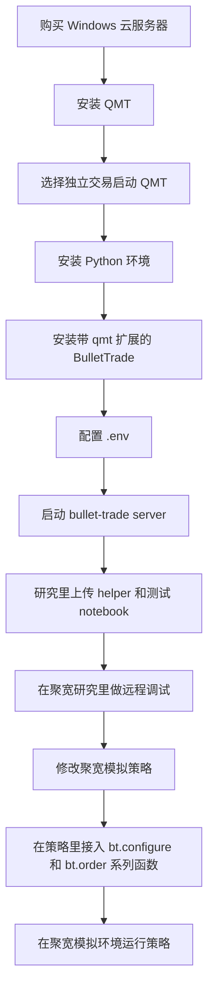

# 方案 B：策略在聚宽侧模拟盘运行

[返回新手入门总览](beginner-guide.md)

这一条路的意思是：

- 策略逻辑继续放在聚宽侧跑
- 聚宽负责选股、择时和生成买卖动作
- BulletTrade 负责把这些动作转发到本地或云端 Windows QMT / MiniQMT 机器执行

这条路线适合：

- 复杂策略现在就在聚宽侧跑
- 你短期目标是先接通实盘，不是先把策略全部本地化
- 策略依赖聚宽侧研究环境、平台权限表、复杂选股或财务链路
- 你暂时判断不清哪些函数兼容、哪些函数不兼容

## 总流程图



## 第一章：准备 Windows 云服务器和 QMT / MiniQMT

这台 Windows 机器可以是：

- 你自己的 Windows 电脑
- Windows 云服务器

如果你打算长期远程跑，建议直接用 Windows 云服务器。  
例如：

- 阿里云 Windows 云服务器
- 腾讯云 Windows 云服务器

新手起步时，服务器一般用 `2C 4G`、`3M` 带宽、带独立公网 IP 就够了。  
常见活动价通常在几十元到两百元一年这个区间，具体还是以各家云厂商当期活动页为准。

在这台机器上，你要先完成 3 件事：

1. 安装 QMT
2. 启动支持 MiniQMT 的 QMT 环境
3. 登录 QMT 账号

### 建议的基础准备

- 已按 [环境准备：先安装 Python，再创建虚拟环境](python-setup.md) 完成 Python 安装
- 已安装并登录的 QMT，并且该环境支持 MiniQMT
- 一台可以运行 QMT / MiniQMT 的 Windows 机器
- 如果要远程连这台机器，还要能配置防火墙和公网访问

这里有两个关键要求：

- 后面的本地取数和远程 server 都默认你能访问 `userdata_mini`
- 登录时请选择 **独立交易** 方式启动 QMT

可以参考下面这两张图：


到这一步，你的目标只有一个：**先让 QMT 在这台 Windows 机器上稳定登录。**


## 第二章：安装 Python 和 BulletTrade

如果这台机器还没有 Python，先完成：

- [环境准备：先安装 Python，再创建虚拟环境](python-setup.md)

这台机器要直接连接本地 QMT，并且要启动 `bullet-trade server`，所以建议直接安装带 QMT 扩展的版本：

```bash
pip install "bullet-trade[qmt]"
```

如果你还不知道 `.env` 是什么，或者不知道怎么在 Windows 里创建这个文件，先看：

- [什么是 `.env` 文件，怎么创建](python-setup.md#env-file)

## 第三章：配置并启动远程 `bullet-trade server`

先准备 `.env` 文件。  
下面这个代码块不是命令，而是要写进 `.env` 文件里的内容：

```env
QMT_DATA_PATH=C:\QMT\userdata_mini
QMT_ACCOUNT_ID=123456
QMT_SERVER_TOKEN=secret
```

然后启动：

```bash
bullet-trade --env-file .env server --listen 0.0.0.0 --port 58620 --enable-data --enable-broker
```

请注意：

- 不要写 `--data-path`
- 账号、数据目录、token 都放在 `.env`

启动成功后，你应该能看到服务监听日志。


## 第四章：放通端口，确认外网能访问

如果你用的是 Windows 云服务器，到这一步必须确认端口已经放通。  
这里通常要同时检查两层：

1. 云平台安全组 / 防火墙
2. Windows 自带防火墙

### 云平台要放通什么

对新手来说，最小要求就是：

- 放通入站 `TCP`
- 端口 `58620`

如果你用的是：

- 阿里云：到云服务器对应的安全组里放通 `58620/TCP`
- 腾讯云：到云服务器对应的安全组或轻量服务器防火墙里放通 `58620/TCP`

### Windows 本机也要放通

如果 Windows 第一次启动 `bullet-trade server` 时弹出了防火墙提示，要允许放行。  
如果没有弹窗，就手动到 Windows Defender 防火墙里检查这台机器是否已经允许该端口或该程序。


### 怎么测试端口通不通

先在 Windows 云服务器本机检查服务有没有监听：

```bash
netstat -ano | findstr 58620
```

如果你看到 `0.0.0.0:58620` 或对应端口的监听信息，说明服务已经在本机起来了。

然后在你自己的另一台机器上测试公网端口是否能打通。

Windows PowerShell 可以用：

```powershell
Test-NetConnection your.server.ip -Port 58620
```

macOS / Linux 可以用：

```bash
nc -vz your.server.ip 58620
```

如果测试通过，通常会看到：

- `TcpTestSucceeded : True`
- 或者 `succeeded`

## 第五章：把 helper 和测试 notebook 上传到聚宽研究根目录

如果你前面是在 Windows 云服务器上启动了 QMT 和 `bullet-trade server`，到这里就先不要动云服务器那边了。  
保持：

- QMT 已按独立交易方式登录
- `bullet-trade server` 正在运行

然后切到聚宽侧继续下面的联调。

仓库里已经提供了现成文件：

- `helpers/bullet_trade_jq_remote_helper.py`
  下载链接：[bullet_trade_jq_remote_helper.py](https://github.com/BulletTrade/bullet-trade/blob/main/helpers/bullet_trade_jq_remote_helper.py)
- `helpers/jq_remote_strategy_example.py`
  下载链接：[jq_remote_strategy_example.py](https://github.com/BulletTrade/bullet-trade/blob/main/helpers/jq_remote_strategy_example.py)
- `bullet_trade/notebook/04.joinquant_remote_live_trade.ipynb`
  下载链接：[04.joinquant_remote_live_trade.ipynb](https://github.com/BulletTrade/bullet-trade/blob/main/bullet_trade/notebook/04.joinquant_remote_live_trade.ipynb)

这里要分清楚两个位置：

- **聚宽研究根目录**：上传 `bullet_trade_jq_remote_helper.py` 和 `04.joinquant_remote_live_trade.ipynb`
- **聚宽策略**：`jq_remote_strategy_example.py` 不需要上传到研究里，它是“策略怎么修改”的参考文件，应该放到聚宽策略里参考或对照修改

建议上传到 **聚宽研究根目录** 的文件只有：

- `bullet_trade_jq_remote_helper.py`
- `04.joinquant_remote_live_trade.ipynb`

上传位置尽量就是研究根目录，不要先放到别的子目录。  
这样后面在聚宽里直接写：

```python
import bullet_trade_jq_remote_helper as bt
```

就能直接找到文件。


## 第六章：先在聚宽研究 / Jupyter 里做一次远程调试

这里说的调试，是在 **聚宽自己的研究环境 / Jupyter 页面** 里做。  
不是在我们本地再开一个 `bullet-trade lab`。

你可以用两种方式：

- 或者直接打开刚上传的 `04.joinquant_remote_live_trade.ipynb`，在聚宽研究 / Jupyter 里测试 helper
- 或者在聚宽研究 / Jupyter 里新建一个测试文件，把下面这段代码粘进去

如果你是第一次联调，优先建议直接用这个 notebook。  
它更适合做“先连通、先查账户、先查持仓”的最小验证。

先做最小检查：

```python
import bullet_trade_jq_remote_helper as bt

bt.configure(
    host="your.server.ip",
    port=58620,
    token="secret",
    debug=True,
)

acct = bt.get_account()
positions = bt.get_positions()

print("可用资金:", acct.available_cash)
print("总资产:", acct.total_value)
print("持仓数量:", len(positions))
```

你第一次联调时，重点看两个地方：

- 聚宽研究 / Jupyter 页面里，是否已经成功打印出账户和持仓
- Windows 云服务器上的 `bullet-trade server` 日志里，是否已经出现新的连接和访问日志

如果聚宽这边运行了代码，但云服务器上完全没有新日志，优先怀疑：

- 公网 IP 写错
- 端口没放通
- token 不一致
- 云服务器安全组或 Windows 防火墙没放行


## 第七章：选择聚宽策略改法

把聚宽策略接到 BulletTrade，有两种改法：

| 方案 | 文档 | 特点 |
| --- | --- | --- |
| 聚宽接入方案 A：显式调用 helper | [方案 A：显式调用 helper](joinquant-helper-explicit.md) | 下单处改成 `bt.order(...)`、`bt.order_target_value(...)`，行为清楚，改动较多 |
| 聚宽接入方案 B：接管聚宽函数 | [方案 B：接管聚宽函数](joinquant-live-takeover-usage.md) | 在 `process_initialize` 安装兼容层，原策略的 `order(...)`、`context.portfolio` 尽量不改 |

建议：

- 第一次联调先用方案 A 在聚宽研究里查通账户和持仓。
- 正式迁移存量聚宽模拟盘策略，优先看方案 B。
- 如果策略只有一两个下单点，并且不依赖聚宽虚拟盘的现金和持仓判断，方案 A 也可以长期使用。

更完整的优缺点对比见 [聚宽策略接入方案对比](joinquant-integration-options.md)。

下面保留的是方案 A 的手动替换说明；如果你采用方案 B，直接看 [方案 B：接管聚宽函数](joinquant-live-takeover-usage.md)。

### 方案 A：显式调用 helper 的改法

很多用户卡在这里。  
核心原则其实很简单：

- **选股和信号逻辑尽量不动**
- **真正的买卖动作改成调用 helper**

如果你不知道策略文件该怎么改，可以把下面这个参考文件上传到 **聚宽策略** 里，对照着改你自己的策略：

- [jq_remote_strategy_example.py](https://github.com/BulletTrade/bullet-trade/blob/main/helpers/jq_remote_strategy_example.py)

#### 1. 文件头上要加什么

这里建议你把文档理解成：  
**保留你原来策略文件顶部的平台导入和原有逻辑，只新增 helper 相关代码。**

你需要新增的是：

```python
import bullet_trade_jq_remote_helper as bt
```

如果你原来的策略文件已经能在平台侧正常运行，这里不要先去大改原来的导入。

#### 2. 远程服务器参数放在哪里

建议直接写在策略文件开头，先用最直白的方式跑通：

```python
BT_REMOTE_HOST = "your.server.ip"
BT_REMOTE_PORT = 58620
BT_REMOTE_TOKEN = "secret"
```

#### 3. 初始化时要加什么

聚宽环境会重启、刷新代码，所以更稳的写法是：  
**在 `process_initialize` 里做 `bt.configure(...)`。**

最小写法：

```python
import bullet_trade_jq_remote_helper as bt

BT_REMOTE_HOST = "your.server.ip"
BT_REMOTE_PORT = 58620
BT_REMOTE_TOKEN = "secret"


def process_initialize(context):
    bt.configure(
        host=BT_REMOTE_HOST,
        port=BT_REMOTE_PORT,
        token=BT_REMOTE_TOKEN,
    )


def initialize(context):
    set_benchmark("000300.XSHG")
```

#### 4. 买卖的时候改哪些函数

最常见就是把聚宽原来的下单函数，替换成 helper 对应函数。

常见替换关系：

- `order(...)` 改成 `bt.order(...)`
- `order_value(...)` 改成 `bt.order_value(...)`
- `order_target(...)` 改成 `bt.order_target(...)`
- `order_target_value(...)` 改成 `bt.order_target_value(...)`

例如，原来你可能是：

```python
order("000001.XSHE", 100)
order_target_value("510300.XSHG", 100000)
```

改成：

```python
bt.order("000001.XSHE", 100)
bt.order_target_value("510300.XSHG", 100000)
```

#### 5. 第一次联调时怎么改最稳

不要一上来就把整个复杂策略全量改掉。  
更稳的顺序是：

1. 先只加 `import bullet_trade_jq_remote_helper as bt`
2. 再加 `process_initialize` 里的 `bt.configure(...)`
3. 先用 `bt.get_account()`、`bt.get_positions()` 验证连通
4. 最后只替换一两个下单函数做最小测试

## 第八章：先用最小策略测试，再切回正式策略

建议不要第一枪就直接改你最复杂的正式策略。  
先在聚宽里做一个最小联通测试，例如：

```python
import bullet_trade_jq_remote_helper as bt


def process_initialize(context):
    bt.configure(
        host="your.server.ip",
        port=58620,
        token="secret",
    )


def initialize(context):
    set_benchmark("000300.XSHG")
    run_daily(test_remote_trade, time="09:35")


def test_remote_trade(context):
    acct = bt.get_account()
    positions = bt.get_positions()
    log.info(f"[账号] 现金={acct.available_cash:.2f} 总资产={acct.total_value:.2f}")
    log.info(f"[持仓数] {len(positions)}")

    # 第一次联调时，建议先只查账户与持仓
    # 确认通了以后，再把下面这行打开做小额测试
    # bt.order("000001.XSHE", 100, price=None, wait_timeout=10)
```

第一轮联调，建议顺序一定要这样：

1. 先 `bt.get_account()`
2. 再 `bt.get_positions()`
3. 最后才 `bt.order(...)`

不要第一枪就直接下单。

## 第九章：在聚宽模拟环境运行策略

当你已经在聚宽研究 / Jupyter 里验证通过，再把同样的改法带回聚宽模拟环境。

这时候你的重点是同时观察两个地方：

- 聚宽模拟日志
- Windows 上的 `bullet-trade server` 日志

至少要满足下面这些条件，才算这条路线已经跑通：

- 聚宽研究 / Jupyter 里能完成最小远程调试
- 聚宽模拟里能正常执行 helper
- 能查到账户和持仓
- 能发出一笔测试单
- Windows 端能看到 server 收到请求并转发给 QMT
- QMT 侧能看到对应委托

聚宽侧日志示意：


## 常见报错与排查

### 1. 简单策略能买卖，复杂策略没有信号

优先排查这 5 件事：

1. 复杂策略的选股链路是不是根本没有迁移完整
2. 是否依赖财务面、平台权限数据或聚宽侧研究环境
3. 执行侧查询到的行情口径是否与你策略判断时使用的口径不同
4. 调度时间是不是变了，导致条件判断时点不对
5. 当天是否本来就没有满足条件的信号

建议做法：

- 先打印候选股票池
- 再打印每个过滤条件剩下多少标的
- 再打印最终买卖条件是否成立

不要只盯着“为什么没有下单”，更要看“为什么没有信号”。

### 2. 聚宽连不上本地或云端 server

优先排查：

- `host` 和 `port` 是否写对
- `QMT_SERVER_TOKEN` 是否一致
- 服务端是否真的监听在 `0.0.0.0`
- Windows 防火墙是否放行
- 云服务器安全组是否放行端口

### 3. 能查持仓，但下单失败

优先排查：

- QMT 是否已登录
- 账户是否可交易
- 标的是否停牌或不在交易时段
- 可用资金或可卖数量是否不足
- 价格保护或最小委托单位是否触发限制
